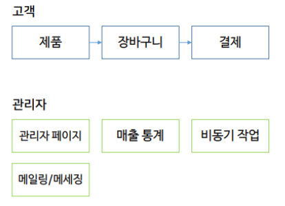

##Django 쇼핑몰 개발

- 쇼핑몰 기본 프로세스

  

  ​

- 필요기능

  - <u>**제품**</u>

    - Model 분리 

      - 핵심 Model

        ```Python

        class Product(models.Model)
        	management_code = models.CharField()
          name = models.CharField(max_length=128, help_text="상품이름")
          standard_price = models.IntergerField(defualt=0, help_text="정가")
          original_sell_price = models.IntergerField(default=0, help_text="기준 판매가")
          sell_price = models.IntergerField(default=0, help_text="현재 판매가")
          ....
          
          
        ```

      - 기타 모델

        - **ShopProduct** : 고객에게 표시될 상품 상세페이지, 상품 표기 사항 등
        - **ShopProductThumbnail** : 제품 썸네일 이미지
        - **ShopProductReview** : 고객 상품 후기
        - **ProductStockTransaction** : 제품 재고 변화 기록 모델
        - 등등

      - 기능적 구분에 따라 추가적인 정보를 저장하는 Model을 추가

      - 각 Model은 핵심 Model(Product)를 FK로 참조

    - **<u>카테고리</u>**

      - 1-depth 혹은 2-depth 정도 복잡하지 않은 카테고리 구조를 가진 쇼핑몰 
        - => 카테고리 정보를 일반적인 Model로 구성
        - => Product모델이 ManyToMany를 이용하여 카테고리를 참조
      - 3-depth 이상?
        - Foreign key-> HELL!!
        - => [Django-mptt](https://github.com/django-mptt/django-mptt)

    - **<u>장바구니</u>**

      - 필요기능
        - 상품 담기
        - 수량 변경
        - 삭제 
        - 가격 계산
        - => (Django-carton)[https://github.com/lazybird/django-carton]

  - 결제연동

    - 아임포트 
      - 읽기 쉬운 API 문서
      - 복수 PG사 연동 가능
      - 복수의 PG사를 연동하는 경우에도 single code base로 구현 가능
      - API를 통한 주문 상태 조회/결제 취소 가능
      - [Python rest client](https://github.com/iamport/iamport-rest-client-python)

  - 관리자 페이지

    - **목적** 및 **사용 대상**에 따라 Django admin과 직접 제작한 UI로 **<u>이분</u>**하여 사용
      - Django admin (**사용자**: 개발자, 쇼핑몰 최종관리자[MD] 등)
        - Model의 내용을 등록, 검색, 수정
        - 컨텐츠 등록 작업, low-level CRUD 작업
      - 직접 제작 UI (**사용자**: 모든맴버)
        - Model 내용 등록/수정이 빈번치 않지만 **<u>복잡한 View logic</u>**을 가진 작업
        - 사용성이 중요한 작업
        - 매출 통계, 주문/배송 조회, 고객센터 문의 관리
    - [Django=grappelli](http://grappelliproject.com/)
    - [Django-summernote](http://summernote.org/)
    - [Django Form Assets](https://docs.djangoproject.com/en/1.11/topics/forms/media/)
    - [AdminLTE](https://adminlte.io/)

  - 매출 통계

  - 비동기 작업/ 작업 스케쥴링

- AWS통한 서비스

  - ElasticBeanstalk
  - S3/CloudFront
  - ​

- Third-Party

  - 제품

    - [Django-mptt](https://github.com/django-mptt/django-mptt)
      - Django ORM을 확장하여 RDBMS 상에서 계층적(Hierarchical)인 데이터를 처리할 수 있도록 해주는 라이브러리
      - Django Manager을 확장하여 트리 탐색을 도와주는 Method를 제공

  - 장바구니

    - (Django-carton)[https://github.com/lazybird/django-carton]
      - Django 기반의 장바구니 라이브러리,
      - Django에서 사용자가 설계한 제품 Model을 장바구니에서 바로 사용 가능하며, __위의 기초적인 장바구니 기능들을 지원__
      - Session을 기반으로 장바구니 내용저장

  - 관리자 페이지

    - [Django-grappelli](http://grappelliproject.com/)
    - Django 기본Admin의 부족한 부분을 보완 
      - 보다 미려한 UI
      - 향상된 Filter
      - jQuery기반의 Data Picker 등 편리한 Widget 탑재
      - Foreign key자동완성
    - [Django-summernote](http://summernote.org/)
      - Summernote의 Django Add-on
        - 이벤트, 공지사항, 제품 상세페이지 등 쇼핑몰 많은 부분에 HTML편집이 필요 but-> 쇼핑몰 관리 담당자는 HTML 모름
        - -> WYSIWYG (What You See Is What You Get)
          - WYSIWYG 에디터인 Summernote를 Django Admin에 손쉽게 통합 가능
    - [Django Form Assets](https://docs.djangoproject.com/en/1.11/topics/forms/media/)
      - 사용자 정의 CSS/JS 파일을 Admin Form에 삽입하는 기능
      - 일부 UI 개선
      - Javascript를 이용한 추가 삽입 가능
    - [Django Aggregation](https://docs.djangoproject.com/en/1.11/topics/db/aggregation/)
      - .annotate(), .extra(), .aggregate()등을 조합하여 사용해 꽤 복잡한 SQL 구문도 Django ORM을 통해 개발 가능
      - ORM으로 구현하기 너무 복잡한 일부 join 구문에 대해서는 .raw() method를 사용하여 직접 raw SQL을 실행하도록 함

    ​

- 기타 사항

  - 메일링
  - 버그트레킹 
  - 측정 및 분석